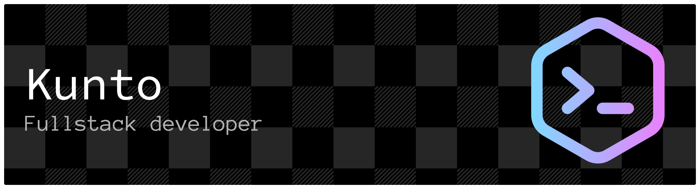

I'm a Full-Stack Developer based in Indonesia. I design, build, and deploy end-to-end web applications — from database architecture to user interface.

I focus on creating reliable, scalable, and maintainable solutions for business applications, automation systems, and internal tools.

## What I Do

- Build full-stack web applications (backend + frontend)
- Design REST APIs & system integrations
- Develop database-heavy business systems
- Create automation workflows (Telegram, Google Sheets, AI integrations)
- Maintain & optimize production servers
- Most production projects are private repositories.
- This GitHub is where I experiment, build learning projects, and share technical explorations.

## Tech Stack

<!-- **Backend:** PHP (Laravel, Codeigniter), Node.js (Express), golang (gin),pyhton   -->

**Backend:**
      
**Frontend:**
       

**Database:**
MySQL, PostgreSQL, SQLServer, DB2  
**DevOps:**
Docker (Portainer), Ubuntu servers  
**Tools:**
Git, VS Code, Copilot

## Work With Me

Available for freelance projects:

- PHP web applications
- Full-stack development (prototype to production)

Remote work, flexible hours. Open to Indonesian and international clients.

## 📫 Let's Connect

  
  
  

---
